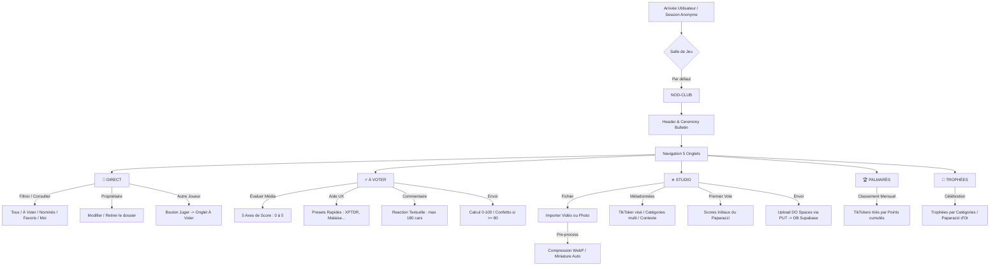

# 👑 NOD — Audit Complet & Schéma Détaillé de l'Application
## Cartographie Souveraine, Évaluation Critique & Plan d'Action

Ce document dresse une vue d'ensemble exhaustive et sans concessions de l'application **NOD (Nominees or Denominees)** en version 3.0. Il sert de schéma directeur avant de lancer toute modification du code.

---

## 1. CARTOGRAPHIE FONCTIONNELLE ET SCHÉMA DE L'APPLICATION

L'application NOD est structurée comme une Single Page Application (PWA) de type mobile-first, organisée autour de **5 onglets principaux**, d'une navigation par swipe et d'une synchronisation en temps réel via Supabase Realtime.



---

## 2. SPÉCIFICATION DÉTAILLÉE DES COMPOSANTS ET FLOUX

### 2.1 — Système d'Identité et de Session
* **Authentification** : Utilise l'authentification anonyme native de Supabase. Au chargement, `ensureAnonymousSession` vérifie si une session est active. Sinon, elle appelle `client.auth.signInAnonymously()`.
* **Identifiant Unique (UID)** : Le UID de Supabase sert de pivot de sécurité pour toutes les tables (colonne `submitted_by` dans `nominations` et `voter_id` dans `ratings`).
* **Pseudo** : Stocké localement sous la clé `nod_pseudo` dans le `localStorage`. S'il est absent, il est auto-généré sous la forme `Joueur [4 premiers caractères du UID]`. L'utilisateur peut le modifier dans l'interface de configuration.
* **Salle (Room)** : Stockée sous `nod_room_code`. Par défaut : `NOD-CLUB`. Si la salle n'existe pas en base de données, l'application la crée via une opération `UPSERT` sur le code unique de la salle.

### 2.2 — Les 5 Onglets de l'Application

#### Onglet 1 : 🔴 DIRECT (Le Feed de l'Activité)
* **Header Ticker** : Bannière défilante affichant le compte à rebours de la prochaine cérémonie et le nombre de dossiers actuellement en jeu.
* **Ceremony Bulletin** : Encadré de résumé qui affiche :
  * Le nombre de dossiers que l'utilisateur doit voter.
  * Un bouton d'accès rapide vers la file d'attente de vote.
  * Le meneur actuel (TikToker avec le plus de points).
  * Le détenteur actuel du trophée "Paparazzi d'Or".
* **Filtres de flux** :
  * **Tout** : Tous les dossiers soumis dans la salle.
  * **À voter** : Dossiers soumis par d'autres que l'utilisateur n'a pas encore évalués.
  * **Nominés** : Dossiers ayant reçu au moins 2 votes (considérés comme acceptés).
  * **Favoris (Elite)** : Dossiers ayant obtenu une note globale supérieure ou égale à 80/100.
  * **Moi** : Les dossiers soumis par l'utilisateur lui-même.
* **Double colonne de cartes (Tiles)** :
  * Affiche la miniature du média (avec un shimmer doré pendant le chargement).
  * Affiche le nom du TikToker visé et les catégories sélectionnées.
  * Affiche des badges contextuels ("Attente", "Nominé", "Moi").
  * **Actions** :
    * Si le dossier appartient à l'utilisateur : boutons "Modifier" (ouvre le Studio en mode édition) et "Retirer" (suppression définitive).
    * Si le dossier appartient à quelqu'un d'autre et n'est pas noté : bouton "Juger" qui redirige vers l'onglet "À voter".

#### Onglet 2 : ⚡ À VOTER (La File de Jugement)
* Affiche un à un les dossiers soumis par d'autres joueurs que l'utilisateur en cours n'a pas encore notés.
* **Affichage média** : Le composant `MediaFrame` joue la vidéo en boucle (ou affiche l'image) de manière optimisée.
* **Système d'évaluation** :
  * 5 curseurs (Sliders) pour évaluer de 0 à 5 : *Rire (😂)*, *Surprise (🤯)*, *Gêne (🤦)*, *Fierté (✊)*, *Intérêt (🤔)*.
  * 5 boutons d'évaluation rapide (Presets) :
    * **XPTDR** : Rire max (5/3/1/1/3)
    * **Malaise** : Gêne max (1/2/5/0/2)
    * **Masterclass** : Fierté/Technique max (2/4/0/5/4)
    * **Choc** : Surprise max (2/5/2/2/5)
    * **Roue Libre** : Chaos fun (4/4/3/1/3)
* **Commentaire de réaction** : Zone de texte de 180 caractères maximum.
* **Bouton d'enregistrement** : Affiche le calcul dynamique de la note finale sur 100. Lors du clic, déclenche :
  * Une vibration haptique.
  * Une explosion de confettis sur l'écran (couleurs dorées et blanches si score ≥ 80).
  * L'insertion en base et la transition vers le dossier suivant.

#### Onglet 3 : ➕ STUDIO (Le Lancement de Dossiers)
* **Sélecteur de média** : Permet de choisir une vidéo ou une image depuis la bibliothèque du téléphone.
* **Traitement client** :
  * Si image : compression WebP à 84% de qualité, redimensionnement dans un canevas max 1440x1080.
  * Si vidéo : extraction automatique d'une miniature au format JPEG à 100ms de lecture pour l'utiliser comme image de couverture.
* **Formulaire** :
  * Nom du TikToker (max 48 caractères).
  * Grille de multi-sélection des 9 catégories officielles.
  * Commentaire explicatif (3 à 240 caractères).
  * **Note initiale** : Le créateur attribue la première note du dossier pour donner l'impulsion.
* **Mécanique d'envoi** :
  1. Envoi d'une requête POST à `/api/media/upload` pour générer une URL de dépôt signée sur DigitalOcean Spaces (S3).
  2. Envoi du fichier binaire par PUT direct vers DigitalOcean.
  3. Si échec, tentative de secours sur Supabase Storage.
  4. Insertion de la ligne dans la table `nominations`.
  5. Vote automatique initial de l'auteur dans la table `ratings`.

#### Onglet 4 : 🏆 PALMARÈS (Le Tableau de Bord)
* Affiche la liste des TikTokers qui ont été nominés au cours du mois en cours.
* **Statistiques par TikToker** :
  * Points totaux accumulés.
  * Nombre de votes reçus.
  * Note moyenne (sur 5).
  * Taux de succès (% de dossiers qualifiés pour la finale).
  * Distribution des notes (étoiles de 1 à 5).
  * Détail des dimensions émotionnelles cumulées.
* **Tri du classement** : Points cumulés desc, puis taux de succès desc, puis note moyenne desc, puis ordre alphabétique.

#### Onglet 5 : 👑 TROPHÉES (La Course Mensuelle)
* **TikToker du Mois** : Affiche le leader du palmarès général.
* **Paparazzi d'Or** : Affiche la nomination individuelle ayant accumulé le plus de points.
* **Course par catégorie** : Affiche un classement spécifique pour chacun des 9 trophées officiels (Le Zin du mois, La Honte de la oumma, XPTDR...), recalculé avec les coefficients dédiés de la catégorie.

---

## 3. SCHÉMA DE BASE DE DONNÉES (POSTGRESQL / SUPABASE)

```
                       ┌────────────────┐
                       │     rooms      │
                       ├────────────────┤
                       │ id (UUID) [PK] │
                       │ code (TEXT)    │
                       │ created_at     │
                       └───────┬────────┘
                               │ 1
                               │
                               │ 1..N
                       ┌───────▼────────┐
                       │  nominations   │
                       ├────────────────┤
                       │ id (UUID) [PK] │
                       │ room_id [FK]   │
                       │ category_id    │
                       │ category_ids[] │
                       │ tiktoker_name  │
                       │ media_url      │
                       │ submitted_by   │
                       │ status (Enum)  │
                       │ created_at     │
                       └───────┬────────┘
                               │ 1
                               │
                               │ 0..N
                       ┌───────▼────────┐
                       │    ratings     │
                       ├────────────────┤
                       │ id (UUID) [PK] │
                       │ nomination_FK  │
                       │ voter_id       │
                       │ rating_stars   │
                       │ rating_points  │
                       │ rire_score     │
                       │ surprise_score │
                       │ gene_score     │
                       │ fierte_score   │
                       │ interet_score  │
                       │ comment        │
                       └────────────────┘
```

### 3.1 — Table `rooms`
* `id` : `uuid` (Clé primaire, valeur par défaut `gen_random_uuid()`).
* `code` : `text` (Unique, longueur de 3 à 24 caractères, indexé).
* `created_at` & `updated_at` : `timestamptz`.

### 3.2 — Table `categories` (Lecture seule pour les clients)
* `id` : `text` (Clé primaire).
* `label` : `text`.
* `mood` : `text` (check : `positive`, `critical`, `fun`, `surprise`).
* `sort_order` : `integer` (Unique).
* `active` : `boolean` (Default `true`).

### 3.3 — Table `nominations`
* `id` : `uuid` (Clé primaire).
* `room_id` : `uuid` (Référence `rooms(id)` avec cascade au delete).
* `category_id` : `text` (Référence `categories(id)`).
* `category_ids` : `text[]` (Toutes les catégories sélectionnées, défaut `{}`).
* `tiktoker_name` : `text` (Longueur 2 à 48 caractères).
* `media_url` : `text` (Lien direct vers l'image ou la vidéo).
* `video_storage_path` & `thumbnail_storage_path` : `text` (clés DigitalOcean).
* `thumbnail_url` : `text`.
* `media_kind` : `text` (check : `video`, `image`, défaut `image`).
* `comment` : `text` (Longueur 3 à 240 caractères).
* `submitted_by` : `text` (UID Supabase Auth).
* `status` : `nomination_status` (Enum : `pending`, `accepted`, `rejected`).
* `created_at` & `updated_at` : `timestamptz`.

### 3.4 — Table `ratings`
* `id` : `uuid` (Clé primaire).
* `nomination_id` : `uuid` (Référence `nominations(id)` avec cascade).
* `voter_id` : `text` (UID Supabase Auth du votant).
* `rating_stars` : `integer` (0 à 5).
* `rating_score` : `numeric(4,2)` (0.00 à 5.00).
* `rating_points` : `integer` (0 à 100).
* `rire_score`, `surprise_score`, `gene_score`, `fierte_score`, `interet_score` : `integer` (0 à 5).
* `comment` : `text` (Longueur 0 à 180 caractères).
* `created_at` : `timestamptz`.
* **Contrainte Unique** : `(nomination_id, voter_id)` pour empêcher un joueur de voter deux fois pour le même dossier.

---

## 4. ÉVALUATION TECHNIQUE ET NOTES (SUR 10)

Chaque grand aspect de l'application a été évalué selon les standards d'ingénierie logicielle mobile.

### 4.1 — Identité Visuelle et Thème (Note : 8.5/10)
* **Le bon** : L'esthétique Dark Gold brutale est d'une grande cohérence. L'utilisation du champagne `#d4af37` sur fond `#050505` avec du blanc crème `#f5f1e8` crée un style "tabloïd underground" très haut de gamme. Les polices condensées et les stickers obliques renforcent l'aspect compétition.
* **À améliorer** : Le Ticker de défilement en haut de l'écran est actuellement brisé en CSS (invisible sur la plupart des terminaux car il utilise `text-indent` d'une manière incompatible avec l'animation).
* **Verdict** : L'impact visuel initial est fort, mais quelques détails gâchent l'harmonie.

### 4.2 — Expérience Utilisateur (UX) et Logic (Note : 5/10)
* **Le bon** : La navigation par swipe tactile (drag horizontal Framer Motion) et les vibrations haptiques au toucher miment le comportement d'une application native iOS.
* **Les failles critiques de logique** :
  * **Le bug de l'utilisateur propriétaire** : Quand un utilisateur soumet un dossier, il se voit parfois afficher le bouton **"Juger"** à la place du badge d'attente, ou voit le dossier comme appartenant à autrui. Cela provient d'un effondrement de l'identification de session : l'application utilise un UUID de repli (`00000000-0000-0000-0000-000000000000`) si la session Supabase ou le participant n'est pas prêt, ce qui fausse le calcul `ownsNomination`.
  * **Navigation saccadée** : Changer d'onglet provoque un recalcul immédiat de l'arbre DOM entier, entraînant de légers gels de rendu sur les téléphones de moyenne gamme.
  * **Toasts brutaux** : Les messages d'information et d'erreur apparaissent et disparaissent instantanément sans transition de sortie (`exit` de Framer Motion inopérant car mal positionné).

### 4.3 — Stabilité et Téléchargements Médias (Note : 3.5/10)
* **Les failles critiques** :
  * **DO Spaces Mismatch** : Les identifiants de connexion DigitalOcean en production sont nommés `DO_SPACES_KEY` et `DO_SPACES_SECRET` dans le code de l'API Next, mais le fichier `.env.local` du projet utilise `SPACES_KEY` et `SPACES_SECRET` (laissés vides). Cette inadéquation provoque des erreurs HTTP 500 systématiques sur le serveur Next, ce qui interrompt l'upload et déclenche la fonction d'erreur du composant `MediaFrame`.
  * **Textes d'erreur inadaptés** : L'apparition du texte *"Rec à renvoyer depuis le Studio"* est déstabilisante pour l'utilisateur qui vient pourtant d'uploader sa vidéo. Elle n'indique pas que le fichier est manquant en ligne, mais simplement que le lecteur vidéo n'a pas pu le charger (à cause de l'échec de l'upload préalable).
  * **Absence de résilience réseau** : Pas de timeout explicite sur les appels fetch. Sur une connexion 4G instable, l'upload reste suspendu indéfiniment sans avertissement.

### 4.4 — Architecture et Maintenabilité (Note : 4/10)
* **Les failles critiques** :
  * **Le Monolithe page.tsx** : Le fichier principal fait **107 Ko et plus de 2390 lignes de code**. Il gère les types, les constantes, l'initialisation Supabase, le chargement en arrière-plan, les animations de transition, la gestion des formulaires du Studio, l'agrégation des scores du Palmarès, et le rendu HTML de tous les onglets. C'est un anti-pattern Next.js/React. Il est indispensable de découper ce fichier pour isoler les responsabilités.

### 4.5 — Sécurité et Règles de Données (RLS) (Note : 3/10)
* **Les failles critiques** :
  * Bien que des politiques RLS Supabase soient définies dans `schema.sql`, elles accordent des accès globaux (`to anon using (true)`) sans vérifier la cohérence des opérations. N'importe quel client connecté avec la clé publique peut modifier ou supprimer les votes ou dossiers d'un autre joueur en forgeant une requête API simple.

---

## 5. PLAN D'ACTIONS ET PROPOSITIONS D'AMÉLIORATION

Voici la feuille de route technique que nous proposons d'appliquer avec votre accord :

### Phase 1 : Résolution des Bugs de Logique et de Médias (P0 - Urgent)
1. **Correction des variables DigitalOcean** : Aligner les noms des clés dans `src/app/api/media/upload/route.ts` et `.env.local` (`SPACES_KEY` / `SPACES_SECRET` ou `DO_SPACES_KEY` / `DO_SPACES_SECRET`) pour restaurer l'envoi vers les serveurs de stockage.
2. **Correction de la logique d'Authentification / Propriété** : Retravailler `ownsNomination` pour s'assurer que l'ID utilisateur réel (`liveSession.user.id`) est systématiquement synchronisé avec le `participant.id` en cache local et que le repli vers le UUID vide `0000...0000` ne se produit jamais si la session est valide.
3. **Optimisation du MediaFrame** : Empêcher le basculement trop rapide vers l'état d'erreur et afficher des messages d'erreur explicites plutôt que le mystérieux "Rec à renvoyer".

### Phase 2 : Rénovation Esthétique, Animations et Polish UX (P1 - Confort)
4. **Correction du Ticker** : Remplacer l'implémentation obsolète de la bannière défilante par une animation de translation CSS en 2D (`transform: translateX`) robuste, fonctionnelle sur tous les écrans.
5. **Fluidification des Onglets (Bottom Nav)** : Ajouter une transition Framer Motion de type "sliding pill" (pilule glissante) pour la barre de navigation. L'indicateur d'onglet actif glissera harmonieusement d'une icône à l'autre au clic.
6. **Mise en place de Toasts Animés** : Envelopper le composant de Toasts dans `<AnimatePresence>` pour activer de vrais effets d'apparition (fondus/glissements) et de disparition.
7. **Redimensionnement dynamique des listes** : Appliquer la directive `layout` de Framer Motion sur les grilles de dossiers. Si un dossier est jugé ou supprimé, les autres cartes glisseront vers leur nouvelle place de façon continue.

### Phase 3 : Assainissement du Code (P1 - Technique)
8. **Découpage modulaire** : Isoler la logique de `page.tsx` en découpant le fichier en composants autonomes et réutilisables :
   * `src/components/direct/DirectTab.tsx`
   * `src/components/vote/VoteTab.tsx`
   * `src/components/studio/StudioTab.tsx`
   * `src/components/palmares/PalmaresTab.tsx`
   * `src/components/winners/WinnersTab.tsx`
9. **Sécurisation RLS (Optionnelle pour le dev local)** : Restreindre les opérations d'édition et de suppression pour s'assurer qu'un utilisateur ne peut modifier que ses propres lignes.

---

### Résumé des Évaluations

| Composant / Dimension | Note Actuelle | Note Cible | Impact Principal |
|-----------------------|---------------|------------|------------------|
| **Esthétique Globale** | 8.5 / 10 | **9.5 / 10** | Ticker fonctionnel + animations haut de gamme |
| **Logique de Jeu & Session** | 5.0 / 10 | **9.0 / 10** | Fin du bug de double affichage "Juger" / "Attente" |
| **Stabilité des Médias** | 3.5 / 10 | **9.0 / 10** | Rétablissement des uploads DigitalOcean + résilience réseau |
| **Architecture Logicielle** | 4.0 / 10 | **8.5 / 10** | page.tsx allégé, lisible et performant |
| **Sécurité de la DB** | 3.0 / 10 | **8.0 / 10** | RLS restrictif sur les suppressions et modifications |

**Es-tu d'accord avec ce diagnostic détaillé et ce schéma de fonctionnement ? Une fois ton accord donné, nous pourrons passer à l'exécution méthodique de ces améliorations.**
